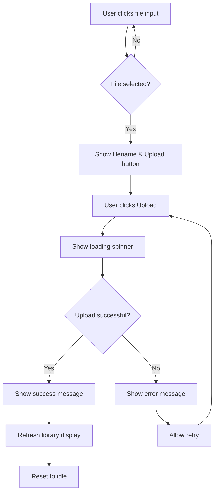

# Contract: Manual JSON Upload

**Feature**: Extension Auto-Sync with Manual Upload Fallback
**Contract Type**: Web UI → API Interaction
**Date**: 2026-02-12

## Overview

This contract defines the manual file upload functionality that allows users to upload a JSON export from the browser extension directly through the web application's library page. This serves as a fallback mechanism when automatic sync is unavailable (e.g., token expired, API issues, user preference).

## Endpoint

**URL**: `POST /api/library/upload`
**New Endpoint**: Yes
**Purpose**: Accept JSON file uploads and process them using existing sync import logic

## Authentication

**Method**: NextAuth session (existing authentication)
**Requirement**: User must be logged into web application
**Validation**: Middleware checks for valid session before processing upload

## Request Format

### HTTP Request

```http
POST /api/library/upload HTTP/1.1
Host: myaudiblelists.com
Cookie: next-auth.session-token=...
Content-Type: multipart/form-data; boundary=----WebKitFormBoundary...
Content-Length: [length]

------WebKitFormBoundary...
Content-Disposition: form-data; name="file"; filename="audible-library.json"
Content-Type: application/json

{
  "titles": [...]
}
------WebKitFormBoundary...--
```

### Request Body

**Content-Type**: `multipart/form-data`
**Field Name**: `file`
**File Type**: `.json`
**Max Size**: 5MB

### File Content Schema

Identical to extension auto-sync payload:

```typescript
interface ManualUploadFile {
  titles: ImportTitle[]
}

// ImportTitle interface same as extension-auto-sync contract
```

### Example File Content

```json
{
  "titles": [
    {
      "asin": "B0FXBHJXPD",
      "title": "Rise of the Cheat Potion Maker Omnibus: Books 1-3",
      "authors": ["Kurtis Eckstein"],
      "narrators": ["Andrea Parsneau"],
      "source": "LIBRARY",
      "listeningProgress": 45,
      "personalRating": 5,
      "dateAdded": "2026-01-15T10:30:00Z",
      "duration": 2538,
      "coverImageUrl": "https://m.media-amazon.com/images/I/91C-ac5K-rL.jpg"
    },
    {
      "asin": "B08G9PRS1K",
      "title": "Dungeon Crawler Carl",
      "authors": ["Matt Dinniman"],
      "narrators": ["Jeff Hays"],
      "source": "LIBRARY",
      "listeningProgress": 0,
      "personalRating": null,
      "dateAdded": "2026-02-01T14:20:00Z"
    }
  ]
}
```

## Response Format

### Success Response (200 OK)

```typescript
interface UploadResponse {
  success: boolean
  imported: number
  newToCatalog: number
  libraryCount: number
  wishlistCount: number
  warnings: string[]
}
```

### Example Success Response

```json
{
  "success": true,
  "imported": 247,
  "newToCatalog": 12,
  "libraryCount": 230,
  "wishlistCount": 17,
  "warnings": [
    "Failed to fetch metadata for ASIN B123XYZ789"
  ]
}
```

### Error Responses

#### 401 Unauthorized - Not Logged In

```json
{
  "error": "Unauthorized - Please log in"
}
```

#### 400 Bad Request - No File

```json
{
  "error": "No file provided"
}
```

#### 400 Bad Request - Invalid File Type

```json
{
  "error": "Invalid file type. Please upload a .json file"
}
```

#### 413 Payload Too Large

```json
{
  "error": "File too large. Maximum size is 5MB"
}
```

#### 400 Bad Request - Invalid JSON

```json
{
  "error": "Invalid JSON format"
}
```

#### 400 Bad Request - Missing Required Fields

```json
{
  "error": "Invalid file structure: missing required field 'titles'"
}
```

```json
{
  "error": "Title at index 3 missing required field: asin"
}
```

#### 500 Internal Server Error

```json
{
  "error": "Failed to process upload. Please try again"
}
```

## UI Component Behavior

### Upload Component (`manual-upload.tsx`)

**Location**: Displayed on library page (`/library`)
**Initial State**: File input with "Upload Library JSON" label

#### States

1. **Idle**: Waiting for file selection
   - Show file input button
   - Show help text: "Upload a JSON export from the browser extension"

2. **File Selected**: File chosen but not uploaded
   - Show selected filename
   - Show file size
   - Enable "Upload" button

3. **Uploading**: POST in progress
   - Disable all buttons
   - Show loading spinner
   - Show progress message: "Uploading and processing..."

4. **Success**: Upload completed
   - Show success message with import stats
   - "Successfully imported X titles (Y new to catalog)"
   - Refresh library display
   - Reset to idle state

5. **Error**: Upload failed
   - Show error message
   - Show "Try Again" button
   - Keep selected file (allow retry)

### Component Interface

```typescript
interface ManualUploadProps {
  onSuccess?: (stats: UploadResponse) => void
  onError?: (error: string) => void
}

interface ManualUploadState {
  file: File | null
  uploading: boolean
  error: string | null
  success: UploadResponse | null
}
```

### User Interaction Flow



## API Implementation

### Endpoint Handler (`/api/library/upload/route.ts`)

```typescript
export async function POST(request: NextRequest) {
  // 1. Check authentication
  const session = await auth()
  if (!session?.user?.id) {
    return NextResponse.json({ error: "Unauthorized - Please log in" }, { status: 401 })
  }

  // 2. Parse multipart form data
  const formData = await request.formData()
  const file = formData.get('file') as File | null

  if (!file) {
    return NextResponse.json({ error: "No file provided" }, { status: 400 })
  }

  // 3. Validate file type
  if (!file.name.endsWith('.json')) {
    return NextResponse.json({ error: "Invalid file type. Please upload a .json file" }, { status: 400 })
  }

  // 4. Validate file size
  if (file.size > 5 * 1024 * 1024) { // 5MB
    return NextResponse.json({ error: "File too large. Maximum size is 5MB" }, { status: 413 })
  }

  // 5. Read and parse file contents
  const contents = await file.text()
  let data
  try {
    data = JSON.parse(contents)
  } catch {
    return NextResponse.json({ error: "Invalid JSON format" }, { status: 400 })
  }

  // 6. Validate structure
  if (!data.titles || !Array.isArray(data.titles)) {
    return NextResponse.json({ error: "Invalid file structure: missing required field 'titles'" }, { status: 400 })
  }

  // 7. Reuse existing sync import logic
  const result = await processSyncImport(session.user.id, data.titles)

  // 8. Return response
  return NextResponse.json(result)
}
```

## Testing Scenarios

### Happy Path - Valid File

**Given**:
- User is logged into web application
- User has JSON file from extension

**When**:
- User navigates to library page
- User selects JSON file
- User clicks "Upload" button

**Then**:
- File is uploaded and processed
- Library is updated with new titles
- Success message shows import stats
- Library page refreshes to show new titles

### Error - Not Logged In

**Given**:
- User is not authenticated
- User tries to access library page

**When**:
- NextAuth middleware intercepts request

**Then**:
- User is redirected to login page
- Cannot access upload feature

### Error - Invalid File Type

**Given**:
- User selects a .txt file instead of .json

**When**:
- User clicks "Upload"

**Then**:
- Client-side validation rejects file
- Error message: "Please select a .json file"
- Upload button remains disabled

### Error - File Too Large

**Given**:
- User has JSON file > 5MB

**When**:
- User uploads file

**Then**:
- Server returns 413 error
- Error message: "File too large. Maximum size is 5MB"
- User advised to contact support if library is very large

### Error - Malformed JSON

**Given**:
- User's JSON file is corrupted or incomplete

**When**:
- User uploads file

**Then**:
- Server fails to parse JSON
- Error message: "Invalid JSON format"
- User advised to download fresh export from extension

### Error - Missing Required Fields

**Given**:
- JSON file missing required field (e.g., "asin" or "source")

**When**:
- Server validates structure

**Then**:
- Validation fails
- Error message specifies which field and index
- User advised to download fresh export

### Partial Success - Some Titles Fail

**Given**:
- Valid JSON with 100 titles
- Audnex API fails for 3 titles

**When**:
- Import process continues for remaining titles

**Then**:
- Success response with `imported: 97`
- Warnings array contains 3 failure messages
- User sees "Successfully imported 97 of 100 titles"
- Warnings displayed in expandable section

## Security Considerations

- **Authentication Required**: Must be logged in (NextAuth session)
- **File Size Limit**: Prevents DoS attacks (5MB max)
- **File Type Validation**: Only .json files accepted
- **JSON Parsing Safety**: Wrapped in try/catch to handle malformed input
- **No Token Required**: Uses existing session auth (different from auto-sync)
- **Same User**: Upload only affects logged-in user's library
- **CSRF Protection**: NextAuth provides CSRF token validation

## Performance Expectations

- **File Upload**: Instant (<1 second for files <5MB)
- **JSON Parsing**: <100ms for typical files
- **Import Processing**: 5-30 seconds depending on:
  - Number of titles
  - Number of new titles (requiring Audnex API calls)
  - Network latency to Audnex API
- **UI Responsiveness**: Loading spinner during processing, no page freeze

## Validation Rules

### File Validation

- Extension must be `.json`
- Size must be ≤ 5MB
- Must be valid JSON syntax
- Must contain `titles` array

### Content Validation

- Each title must have: `asin`, `title`, `authors`, `source`, `dateAdded`
- `source` must be "LIBRARY" or "WISHLIST"
- `asin` must be non-empty string
- `authors` must be array (can be empty in edge cases)

### Processing Rules

- Full-replace strategy (deletes existing library entries)
- Fetches metadata from Audnex for new titles
- Creates LibraryEntry records for user
- Returns stats + warnings (non-fatal errors logged, import continues)

## Differences from Auto-Sync

| Aspect | Auto-Sync | Manual Upload |
|--------|-----------|---------------|
| Authentication | Sync token (short-lived, single-use) | NextAuth session (persistent) |
| Trigger | Automatic (extension detects token) | Manual (user uploads file) |
| Entry Point | Extension content script | Web UI component |
| Endpoint | `/api/sync/import` | `/api/library/upload` |
| Content Type | `application/json` | `multipart/form-data` |
| File Size Limit | 50MB | 5MB |
| Use Case | Primary sync path | Fallback/alternative |

## Dependencies

**Client**:
- React 19
- FileReader API
- Fetch API
- File input component

**Server**:
- Next.js 16 App Router
- NextAuth session validation
- FormData parsing (Node.js built-in)
- Existing sync import logic (shared with auto-sync)
- Prisma + PostgreSQL

## Future Enhancements (Out of Scope)

- Drag-and-drop file upload
- Upload progress bar (currently spinner only)
- Batch upload multiple files
- Schedule periodic uploads
- Export library to JSON (reverse operation)
